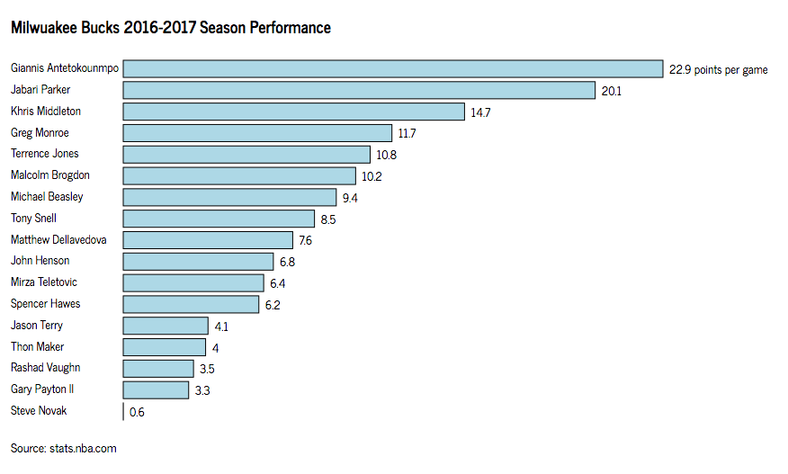
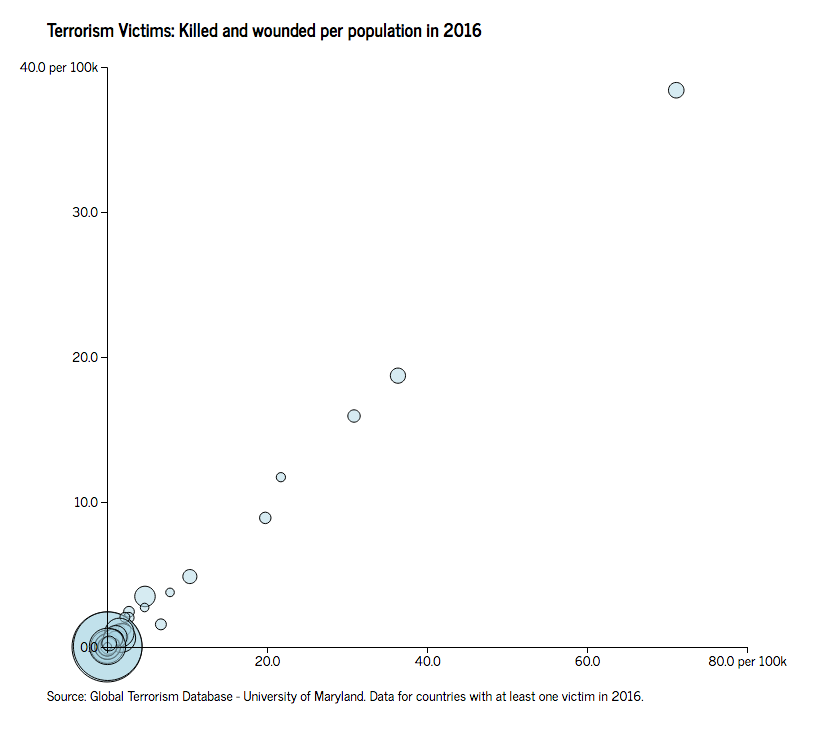
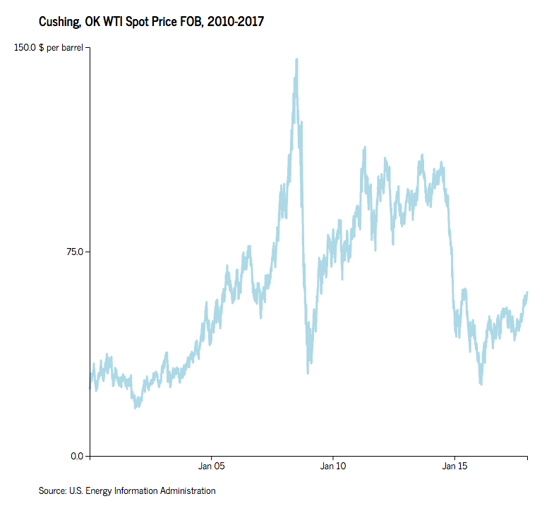

# Generate D3 charts from the command line
Python flask script that lets you generate from the command line D3 basic code for three types of charts: bar, scatter and timeseries plots. Use it for quick previews of your charts, or build on the generated code to create interactive visualizations.

## Usage 

### Dependencies

[Pipenv](https://docs.pipenv.org/) is used for virtualenv/dependency management.

```bash
pipenv install
pipenv shell
```

### Try it out!

For bar plots:

```bash
python generate_D3.py Milwuakee-Bucks_All-Players_2016-2017.csv bar -x PPG -y PLAYER_NAME -xl "points per game" -he 500 -wm 850 5 5 -xs 0.1 600 -sfv lightblue 1 -ssv "#000000" 1 1 -t "Milwuakee Bucks 2016-2017 Season Performance" -ts "stats.nba.com" -l -lp 8000
```



### Details
The script is utilizing the Python [Flask](http://flask.pocoo.org) web framework (which is utilizing the [Jinja2](http://jinja.pocoo.org/) template engine) to render HTML, CSS, and JavaScript templates and build the skeleton D3 code for three types of charts: bar, scatter, and timeseries plots.

When you clone the repository, you download three JavaScript and CSS templates (located in the `templates` directory). When you run the script, passing the appropriate arguments, it reads your data set and generates the D3 code for the requested plot type.

In order to use the script you need to pass at least two positional arguments: the filename of the CSV you want to create the D3 chart from (it needs to be located in the `static/data` directory; and the type of D3 chart you want to create.

In order to generate your chart and customize its styles, you can use the optional arguments/flags below. Some arguments are required for generating the charts (for example scales) and if they're not passed in the script run, you will be prompted to input them later on. For truly optional arguments, if they're not passed the script will generate default values.

The generated code for your D3 charts will be saved in the `build` directory and you can request setting up a local server to preview the outputs.

Run as `python generate_D3.py -h` for help and documentation.

#### Positional arguments

`data_file`: Filename of your data set. Pass just the name of the file, and not the entire path to its directory. Make sure the data set is located inside the `static/data` directory.

`chart_type`: The type of chart you wish to generate. Choose between `bar`, `timeseries`, or `scatter` plots.

#### Optional Arguments / Flags
`-x`, `--x-axis`: Column from your data set to be used for the X axis of your plot. If you're generating a timeseries plot, your data must be in `%m/%d/%y` format.  
`-y`, `--y-axis`: Column from your data set to be used for the Y axis of your plot.  
`-xs`, `--x-axis-scale`: Pass a custom scale for the X axis of your plot. Pass numerical values for bar and scatter plots, and dates in `%m/%d/%y` format for timeseries plot. Pass only min and max values. If not used, X axis scale will be automatically created from the data you generate the X axis from.  
`-ys`, `--y-axis-scale`: Pass a custom scale for the Y axis of your plot. Use it only for scatter and timeseries plots. Pass only min and max values. If not used, Y axis scale will be automatically created from the data you generate the Y axis from.  
`-he`, `--height`: Pass a custom height for your plot. Use it only for bar plot to adjust the scale of the y axis. If not passed, a default value will be used.  
`-xt`, `--x-axis-ticks`: Pass custom ticks to the X axis of your plot. Use it only for scatter and timeseries plots. Pass dates in `%m/%d/%y` format for timeseries plot. Enter 1 value if you want to specify the number of ticks D3 should generate, or enter multiple values to create a custom list of ticks. If not used, it defaults to the default D3 behavior.  
`-yt`, `--y-axis-ticks`: Pass custom ticks to the Y axis of your plot. Use it only for scatter and timeseries plots. Enter 1 value if you want to specify the number of ticks D3 should generate, or enter multiple values to create a custom list of ticks. If not used, it defaults to the default D3 behavior.  
`-xl`, `--x-axis-label`: Specify a key label for the X axis ticks of your plot. It will be added to the last tick of the axis. Use it only for the bar and scatter plots.  
`-yl`, `--y-axis-label`: Specify a key label for the Y axis ticks of your plot. It will be added to the last tick of the axis. Use it only for the scatter and timeseries plots.  
`-r`, `--radius`: Column from your data set to be used for the radius scale of your scatter plot. If not passed, a default value will be used for all dots in the plot.  
`-rs`, `--radius-scale`: Pass a custom scale for the domain of the radius scale of your scatter plot. If not passed, default values will be used.  
`-wm`, `--widths-margins`: Specify the width, the left margin and the right margin of the SVG element of the plot. Pass exactly 3 values. If not passed, default values will be used. If you're generating a bar plot and it's passed along with a custom X axis scale, the width value passed will be overwritten and recalculated if it's less than 200px bigger than the X axis scale, in order to fit bar labels in the plot.  
`-sfv`, `--style-fill-values`: Pass custom fill styles for the elements of your plot. Accepts exactly two values (color and opacity). It will be dropped if it's passed in a timeseries (line) plot. If not passed, default values will be used.  
`-ssv`, `--style-stroke-values`: Pass custom stroke styles for the elements of your plots. Accepts exactly three values (color, opacity and width). If not passed, default values will be used.  
`-t`, `--title`: Set title for the plot. If not passed, the name of the data file will be used.  
`-ts`, `--title-source`: Set source line. If not passed, source line will return empty.  
`-l`, `--localhost`: If passed, the script will also set up a local server for previewing the built plot.  
`-lp`, `--localhost-port`: If you request a local server, use this argument to assign a specific port to run it. If not passed, it defaults to 8000.

## Known issues

- The script only works for data sets in `.csv` format.
- The script uses v4.2.2 of D3.

## More examples

For scatter plots:  

```bash
python generate_D3.py GTD_2016_Per-Population.csv scatter -x kills_per_pop_2016 -y wound_per_pop_2016 -r population_2016 -xs 0 80 -ys 0 40 -rs 3 35 -xt 20 40 60 80 -yt 0 10 20 30 40 -xl "per 100k" -yl "per 100k" -wm 800 100 60 -sfv lightblue 0.5 -ssv "#000000" 1 1 -t "Terrorism Victims: Killed and wounded per population in 2016" -ts "Global Terrorism Database - University of Maryland. Data for countries with at least one victim in 2016." -l -lp 8000
```



For timeseries plots:

```bash
python generate_D3.py WTI_Historical_1986-2018.csv timeseries -x date -y dollars_per_barrel -xs 1/1/2000 12/31/2017 -ys 0 150 -xt 1/1/05 1/1/10 1/1/15 -yt 0 75 150 -yl "$ per barrel" -wm 800 120 60 -ssv lightblue 1 3 -t "Cushing, OK WTI Spot Price FOB, 2010-2017" -ts "U.S. Energy Information Administration" -l -lp 8000
```



#### Acknowledgements

[D3 JavaScript library](https://github.com/d3/d3) created by Mike Bostock; News Cycle font by Nathan Willis via [1001fonts.com](http://www.1001fonts.com/news-cycle-font.html); the Stack Overflow community.
